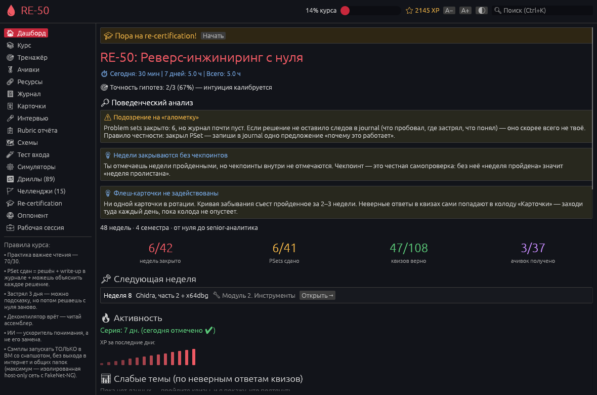
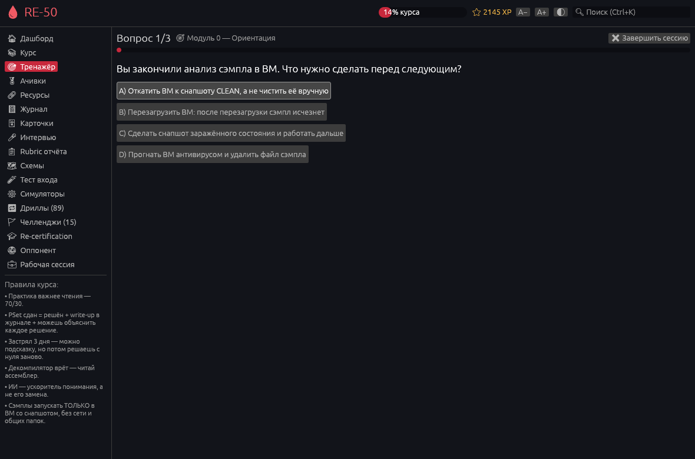
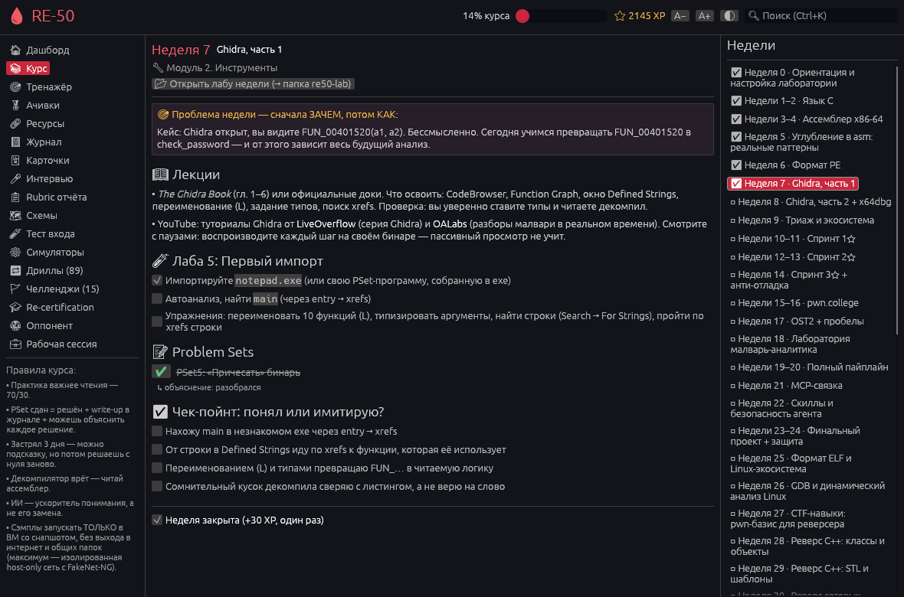
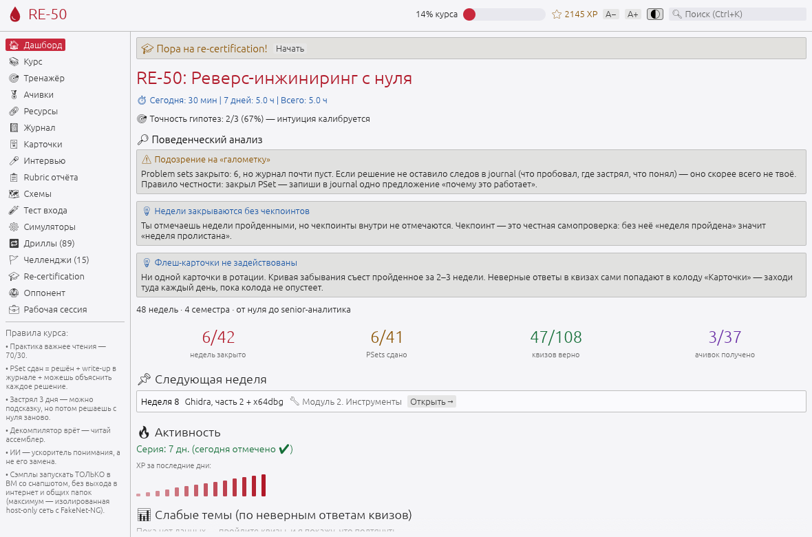

# 🩸 RE-50 — реверс-инжиниринг с нуля

[](https://github.com/alexandershmits/RE/actions/workflows/ci.yml)
[](LICENSE)

Десктопное приложение курса по реверс-инжинирингу в формате CS50: от нуля до senior-аналитика за 48 недель.
Лекции и лабы, problem sets с «правилом честности», тренажёры, интервальные карточки, встроенные crackme-челленджи.
Rust + egui/eframe. Работает на Linux, macOS и Windows, полностью офлайн; прогресс хранится только у вас.

<p align="center">
  
  
</p>
<p align="center">
  
  
</p>

<!-- stats: modules=17 week_entries=42 last_week=48 psets=41 quizzes=108 drills=89 flashcards=20 achievements=37 challenges=15 resources=35 urls=39 -->

## Возможности

- 📚 **Курс:** 17 модулей, 48 недель (42 страницы). На каждой — лекции, чек-пойнт «понял или имитирую» и «проблема недели», на большинстве ещё лаба и problem set. 41 problem set сдаётся только вместе с объяснением своими словами.
- 🎯 **Тренажёр:** 108 квизов с разбором. Неверные ответы сами попадают в колоду 🃏 **карточек** (система Лейтнера: повтор через 1 → 3 → 7 → 14 → 30 дней), выученные — уходят.
- 🔁 **Дриллы (89) и ⚙ симуляторы:** регистры и инструкции (ответы считает встроенный x86-эмулятор), PE-байты, поиск OEP, бесконечный генератор задач.
- 🚩 **15 crackme-челленджей** (Linux ELF и Windows PE) с режимом «Ставка»: гипотеза записывается до решения. Генератор «adversarial loop» делает новые варианты со случайным флагом.
- 🥋 **Socratic-оппонент** (офлайн-эвристика или локальный [Ollama](https://ollama.com)), 💼 **рабочая сессия** аналитика, 🎓 **ежемесячная ре-сертификация**.
- 🏅 **37 ачивок**, XP выдаётся один раз за действие; серия дней, учёт времени, поведенческий анализ («Теоретик», «галометка», разрыв в практике).
- 🔍 Поиск по всему курсу (Ctrl+K), тёмная и светлая темы, масштаб шрифта, экспорт журнала и прогресса. 35 ресурсов; все 39 внешних ссылок курса проверяет `tools/check_links.py`.

## Установка

**Готовый бинарь.** Страница [Releases](https://github.com/alexandershmits/RE/releases): файл для вашей системы и `SHA256SUMS`.

```bash
sha256sum -c --ignore-missing SHA256SUMS
chmod +x re50-linux-x64 && ./re50-linux-x64
```

- **Linux:** нужны `libxkbcommon-x11` и OpenGL (`libgl1`). Debian/Ubuntu: `sudo apt install libxkbcommon-x11-0 libgl1`.
- **macOS:** бинарь собран для Apple Silicon (arm64) и не подписан — при первом запуске «ПКМ → Открыть». На Mac с процессором Intel соберите приложение из исходников (ниже).
- **Windows:** SmartScreen → «Подробнее → Выполнить в любом случае».

**Из исходников** (Rust 1.95 или новее):

```bash
cargo run --release
```

**Если окно не открывается.** Паники и ошибки запуска пишутся в `crash.log` рядом с `progress.json` (пути — ниже); на Windows приложение ещё и показывает окно с причиной. Чаще всего не хватает графики: нужен OpenGL 2.0 или новее — обновите драйвер видеокарты, а в виртуальной машине и при удалённом рабочем столе включите 3D-ускорение.
## Где лежат данные

| ОС | Прогресс |
|---|---|
| Linux | `$XDG_CONFIG_HOME/re50/progress.json` (по умолчанию `~/.config/re50/`) |
| macOS | `~/Library/Application Support/re50/progress.json` |
| Windows | `%APPDATA%\re50\progress.json` |

Запись атомарная (временный файл, `fsync`, переименование). При запуске ротируются копии `progress.json.bak1…5` — только если файл изменился с прошлой копии; повреждённый файл откладывается как `progress.json.corrupt`, а приложение восстанавливает прогресс из последней исправной копии и сообщает об этом. Файл `progress.json.lock` не даёт второму окну затереть прогресс первого: оно откроется только для чтения. Файл, созданный более новой версией приложения, не перезаписывается.
Экспорты (профиль, журнал, лабы недель, бинари челленджей) попадают в домашнюю папку (`re50-lab/`, `re50-profile.json`, `re50-journal.md`).
Переопределить пути можно переменными `RE50_CONFIG_DIR` и `RE50_EXPORT_DIR`.
Рядом с прогрессом лежит `crash.log` (паники и ошибки запуска; больше 256 КБ — сдвигается в `crash.log.old`). Без каталога настроек он пишется во временную папку как `re50-crash.log`.

## Горячие клавиши

`Ctrl+1…9` — вкладки, `Ctrl+J` — журнал, `Ctrl+K` — поиск (на macOS — `⌘` вместо `Ctrl`). «Сутки» для серии, лимита XP и ре-сертификации считаются по местному времени (часовой пояс читается при запуске).

## Безопасность

Челленджи — безобидные учебные программы, но правило курса остаётся правилом: **чужие сэмплы запускать только в виртуальной машине со снапшотом, без выхода в интернет и общих папок.**
Оппонент отправляет ответы только на `127.0.0.1:11434` (локальный Ollama), наружу ничего не уходит.

## Разработка

```bash
cargo fmt --all --check
cargo clippy --all-targets --locked -- -D warnings
cargo test --locked                            # модульные, контентные и UI-тесты (без окна)
python3 tools/verify_challenges.py --rebuild   # хеши, поведение ELF, пересборка из .c (gcc, mingw)
python3 tools/check_links.py                   # проверка внешних ссылок (нужна сеть)
python3 -m unittest discover -s tools -p "test_*.py"   # тесты самих скриптов
cargo deny check                               # лицензии, источники, советы RustSec (нужен cargo-deny)
```

Содержимое курса — данные, а не код. Как их править и какие проверки защищают контент — в [docs/CONTENT.md](docs/CONTENT.md).

```
assets/curriculum.json    курс: недели, квизы, ачивки (с правилами), ресурсы, челленджи
assets/drills.json        дриллы
assets/challenges/        исходники .c, ELF и PE-бинари челленджей
assets/fonts/             Noto Emoji (OFL)
src/state/                прогресс, сессии, XP, карточки, ачивки, экспорт
src/storage.rs            пути по платформам, атомарная запись, бэкапы
src/ui/                   вкладки, тема, разметка текста курса
src/emulator.rs           мини-эмулятор x86-64 для задач на регистры
tests/                    контентные и UI-тесты
tools/                    проверка челленджей и ссылок, генератор вариантов
```

CI (GitHub Actions) прогоняет `fmt`, `clippy -D warnings`, MSRV и тесты на Linux, Windows и macOS, пересобирает челленджи и проверяет лицензии и источники зависимостей (`cargo-deny`); раз в неделю то же запускается по расписанию, а советы RustSec проверяет отдельный workflow `audit`. Релиз по тегу `vX.Y` или `vX.Y.Z` ждёт зелёного CI, собирает бинари под три платформы и публикует контрольные суммы.

**Выпуск релиза.** Поднимите `version` в `Cargo.toml` (три числа, например `7.3.0`), добавьте в `CHANGELOG.md` раздел `## [7.3.0] — ГГГГ-ММ-ДД`, влейте PR в `main` и создайте тег `v7.3` (подойдёт и `v7.3.0`). Workflow `release` дождётся CI, сверит тег с версией, соберёт бинари для Linux, Windows и macOS (arm64) и опубликует релиз: текст берётся из раздела CHANGELOG, рядом лежит `SHA256SUMS`.

## Лицензия

[MIT](LICENSE). Сторонние компоненты и шрифты — в [THIRD_PARTY_NOTICES.md](THIRD_PARTY_NOTICES.md).
